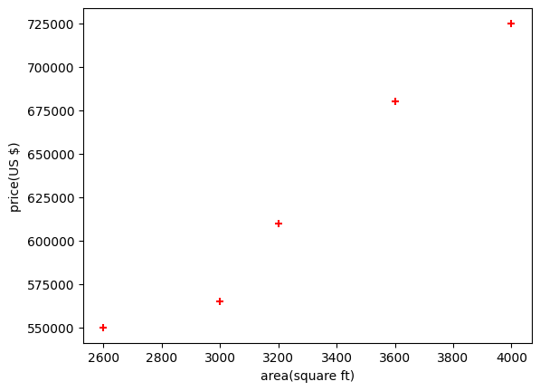
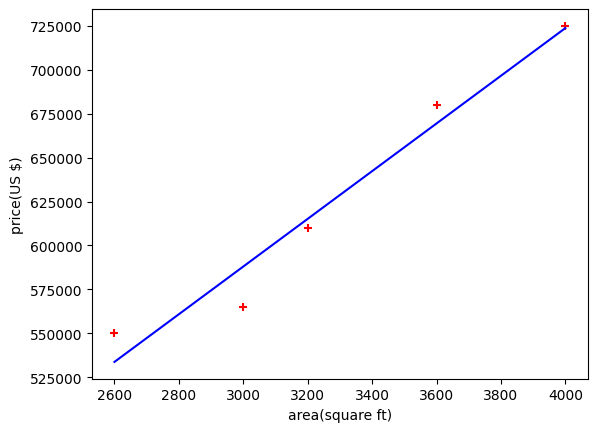

# Single Variable Linear Regression — Python

- demonstrates how to build, visualize, and interpret a simple linear regression model using Python
- showcases the complete workflow with one independent variable (feature) and one target variable

## Dataset
The dataset contains two columns:

- **X (Feature)** → Example: `area` (square feet)  
- **y (Target)** → Example: `price` (USD)

A simple linear regression assumes the relationship:

\[
y = mX + b
\]

Where:
- **m** = slope (coefficient)  
- **b** = intercept  

## Visualization
### &nbsp;&nbsp; ScatterPlot

### &nbsp;&nbsp; Regression Line

## Model Summary
- **Input Feature:** Area (square feet)
- **Target Variable:** Price (USD)
- **Model Type:** Single-variable linear regression
- **Goal:** Fit a regression line that estimates house price based on area

