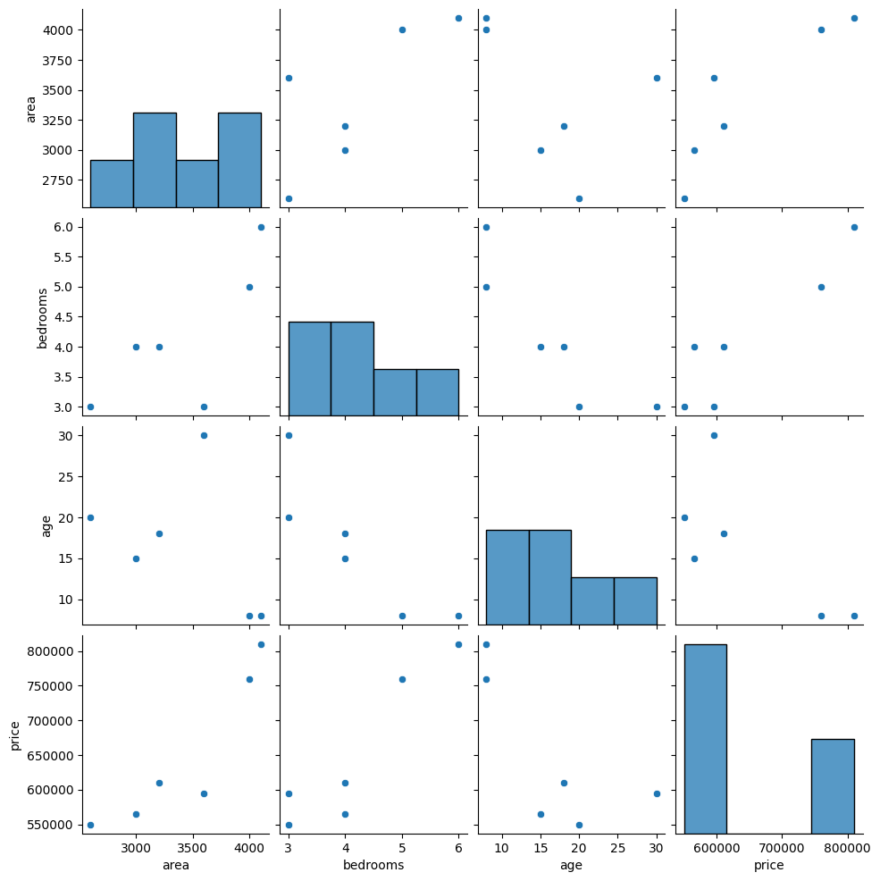
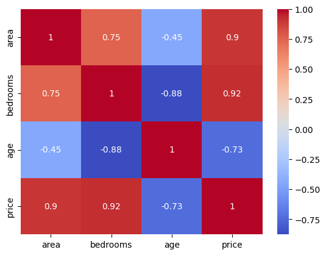

# Multiple Variable Linear Regression — Python

- demonstrates how to build, visualize, and interpret a multiple variable linear regression model using Python
- uses multiple input features to predict a single continuous target value

This repository contains 2 projects:
  1. **House Price Prediction Model** — predicting the price of a house using area, bedrooms, and age  
  2. **Salary Prediction Model (Independent Practice)** — predicting candidate salary based on experience, test score, and interview score  
---

## Overview of Projects
### 1. **House Price Prediction Model**
A supervised machine learning regression model that predicts house price (USD) from:

- `area` — size of the home in square feet  
- `bedrooms` — number of bedrooms  
- `age` — age of the home

#### Model Equation:
\[
price = b_0 + b_1(area) + b_2(bedrooms) + b_3(age)
\]
### 2. **Salary Prediction Model**
A supervised machine learning regression model that predicts salary from:

- `experience` — years of experience
- `test_score(out of 10)`  
- `interview_score(out of 10)`

### Model Equation:
\[
salary = b_0 + b_1(experience) + b_2(test\_score) + b_3(interview\_score)
\]

---
### Highlights:
- Data cleaning (e.g., converting text scores like `"zero"`, `"five"` → numeric values)  
- Fitting a multiple linear regression model  
- Predicting salary/home price based on features  
- Interpreting coefficients  
- Visualizing
---

## Visualization
### Predicting Home Price
#### &nbsp;&nbsp; PairPlot

### &nbsp;&nbsp; Regression Line

